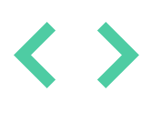

<div align="center">
  <br />
      
  <br />

  <h3 align="center">User Authentication with Profile Management and Avatar Upload</h3>

  <h3> Use this URL to Test this fullstack Application</h3>
  
   <a href="https://my-frontend-r3t8.onrender.com/signup"> Test </a>

 
</div>
  ## 📋 <a name="table">Table of Contents</a>

1. 🤖 [Introduction](#introduction)
2. ⚙️ [Tech Stack](#tech-stack)
3. 🔋 [Features](#features)
4. 🤸 [Quick Start](#quick-start)


## <a name="introduction">🤖 Introduction</a>

This application is built using Node.js for server-side logic, Express.js for handling routes and middleware, and MongoDB

for data storage. It features secure JWT-based user authentication, email login, and avatar. Designed 
 
for simplicity and efficiency, this app aims to provide a seamless voting experience.


## <a name="tech-stack">⚙️ Tech Stack</a>

 **Frontend (React):
 
 **Signup and Login Pages:
 
 **Create forms for user signup and login.
 
 **Allow users to upload their avatar during signup.
 
 **Store the JWT token in localStorage after login.
 
 **Profile Page:

 
 **Fetch the logged-in user's profile details using the JWT token.
 
 
 **Display the profile information and avatar.
 
 
 **Create a form to update the user's name, email, and avatar.
 

 **Backend (Node.js, Express, MongoDB):
 

 **User Authentication:
 

 **Implement registration (POST /api/register) and login (POST /api/login) endpoints.
 

 **Use JWT for authentication.
 


 **Create a middleware to protect the profile routes.
 
 
 **Profile API:
 

 **GET /api/profile/:id : Get the authenticated user’s profile.
 

 **PUT /api/profile/:id : Update the user's profile information, with avatar.

 **Avatar Upload:

 **Used Multer or a similar library to handle file uploads.

 **Store the avatar locally 
 
 **Save the avatar's URL in the user's document in MongoDB.

 **Database (MongoDB):

 **User Collection:

 **Store user information with fields:
 
 **name: String
 
 **email: String (unique)
 
 **password: String (hashed)
 
 **avatar: String (URL to the avatar image)

 **Frontend: React, Axios, React Router, FormData for avatar uploads.
 
 **Backend: Node.js, Express.js, JWT for authentication, Multer for avatar uploads.

 **Database: MongoDB with Mongoose.
  
## <a name="requirements"> Requirements </a>

 **User Signup & Login:

 **Allow users to sign up with the following fields:
 
 **name: String
 
 **email: String
 
 **password: String (hashed)
 
 **avatar: Upload profile picture
 
 **Implement login functionality using email and password.
 
 **Use JWT for authentication.

 **View Profile:

 **After logging in, users should see their profile page displaying:
 
 **name
 
 **email
 
 **avatar (if uploaded, else show a default avatar). 

**Update Profile:

 **Allow users to update their name, email, and avatar.
 
 **Implement profile update functionality so users can upload or change their profile picture

## <a name="features">🔋 Features</a>

👉 **Sign-up/Sign-in**: User can sign-up and get JWT token and user can login with Email and Password.

👉 **Authentication**: Without Authentication user not allowed to access the account.


👉 **Update Avatar**: User can update avatar.

👉 **Can access of user list**:  User can get list of users.


## <a name="quick-start">🤸 Quick Start</a>

Follow these steps to set up the project locally on your machine.

**Prerequisites**

Make sure you have the following installed on your machine:

- [Git](https://git-scm.com/)
- [Node.js](https://nodejs.org/en)
- [npm](https://www.npmjs.com/) (Node Package Manager)

**Cloning the Repository**

```bash
git clone 
cd Aassigmnet
```

**Installation**

Install the project dependencies using npm:

 **backend Deployed URL : https://my-backend-rdvm.onrender.com
 
 **after that you can use above any API's
 
 ** for ex: https://my-backend-rdvm.onrender.com/api/register


**Connect to your MongoDB**

create .env file and add PORT & MONGODB_URI

```bash
npm install
```

**Running the Project**

```bash
npm server.js
```

Open [http://localhost:3000](http://localhost:3000) in your browser to view the project.


